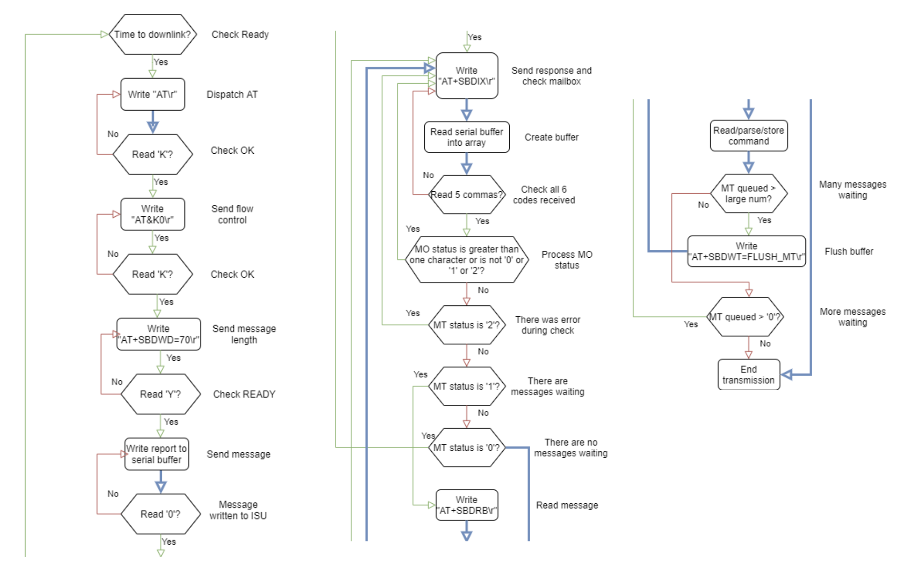
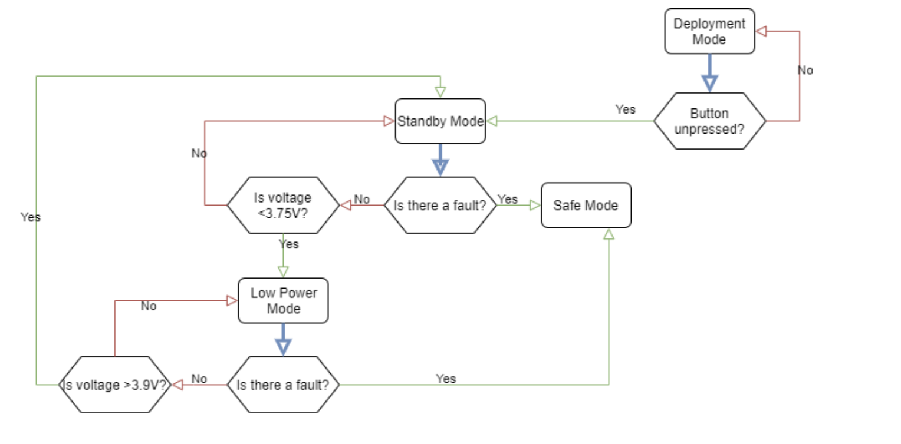
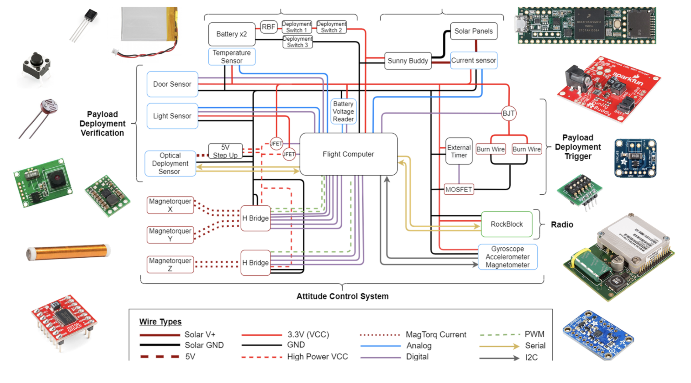

# Alpha CubeSat Flight Code

<!-- - [1. Getting Started] (1-Getting Started) -->
## Getting Started

* Install [VSCode](https://code.visualstudio.com/download)
* Install [Git](https://www.atlassian.com/git/tutorials/install-git)
    * Make a GitHub account if you do not have one already
* In VSCode, click on "Extensions" on the left hand toolbar. Search for and install PlatformIO IDE.
* On the top toolbar, click "Terminal" and then "New Terminal". This should open a terminal at the bottom of your screen if it was not open already.
* In the terminal, type "git clone https://github.com/Alpha-CubeSat/oop-flight-code.git"
* Now at the bottom of your screen in the blue toolbar you should see a check, arrow, and serial monitor icon (it looks like an electrical cord). If you do not see the blue toolbar make sure you have the cloned git repo folder open.
* If you would just like to compile code but not upload to the teensy, press the check.
* If you would like to upload to the teensy, press the arrow.
* You can also use `pio run -e debug -t upload` to upload code with debugging print statements, or `pio run -e teensy35 -t upload` to upload code without debugging print statements.
* Use `pio test` to run unit tests.
* To view the serial monitor press the electrical cord icon.

## Code Overview

This code is structured based on [Lodestar](https://github.com/shihaocao/lodestar), a small scale electric demonstrator for the belly-flop and tail-sitting control algorithms necessary for SpaceX's Starship.

Both ClockManager and TimedControlTask are from [PAN](https://github.com/pathfinder-for-autonomous-navigation).

### main.cpp
This file is comparable to a .ino file you would see in the Arduino IDE (notice setup and loop are exactly the same as they would be in an Arduino file). 

### MainControlLoop
The MainControlLoop initializes and executes every monitor and control task.

### MissionManager
The CubeSat has 4 different modes with distinct entrance and exit conditions
* Standby 
* Safe
* Low Power
* Deployment

MissionManager sets which mode the CubeSat should be in based on these exit/entrance conditions.

### SFR
SFR stands for State Field Registry. It contains the mode of each system, all sensor values, and universal flags that should be available to the entire CubeSat. 

### Control Tasks
Control tasks are any file that actuates/performs a task based on a value in the SFR. 

### Monitors
Monitors simply read input from sensors and update the sensor values in the SFR.

### constants.hpp
Constants contains values that will never be changed. This prevents "magic numbers".

## Alpha Flight Software Requirements

**
 Main Overview 
**
|                            |                                                                                                                                                                                                                                                                                                                                                                                                                                                                                                                                                         |
| -------------------------- | ------------------------------------------------------------------------------------------------------------------------------------------------------------------------------------------------------------------------------------------------------------------------------------------------------------------------------------------------------------------------------------------------------------------------------------------------------------------------------------------------------------------------------------------------------- |
| Main Loop                  | <table>  <thead>   <td>Calls the execute method of Mission Manager, all monitors, and all control tasks.  </td>  </tbody>  </table>                                                                                                                                                                                                                                                                                                                                                                                                                     |
| State Field Registry (SFR) | <table>  <thead>   <td>Contains the mode of each system, all sensor values, and universal flags that should be available to the entire CubeSat.  </td>  </tbody>  </table>                                                                                                                                                                                                                                                                                                                                                                              |
| Fault handling             | <table>  <thead>   <td>Each bit in a fault byte indicates an individual fault. There are currently 3 fault bytes.</td>   </tr>  <tr>  <td>Sensor values are checked by default. If the ground station determines a sensor is faulty and is consistently triggered by a faulty sensor a command can be uplinked to change the boolean indicating that the value should be checked by the fault monitor.</td>   </tr>  <tr>  <td>A fault causes the CubeSat to enter safe mode. An uplink is required to exit safe mode.</td>   </tr>  </tbody>  </table> |
| Communication              | <table>  <thead>   <td>Uplink commands have the ability to alter any value in the SFR. Opcode indicates which variable in the SFR. Argument 1 indicates what to change the value to. Only commands requesting image fragments use argument 2.</td>   </tr>  <tr>  <td>All values in the SFR are periodically downlinked.</td>   </tr>  </tbody>  </table>                                                                                                                                                                                               |

**
 Mission Manager 
**
*Move through mission modes. Certain conditions are set only when entering a mission mode and are therefore only in the transition method. Other conditions need to be checked continuously while in that mission mode.*

|            |                                                                                                                                                                                                                                                                                              |                                                                                                                                                                                                     |
| ---------- | -------------------------------------------------------------------------------------------------------------------------------------------------------------------------------------------------------------------------------------------------------------------------------------------- | --------------------------------------------------------------------------------------------------------------------------------------------------------------------------------------------------- |
| ACS        | Transition                                                                                                                                                                                                                                                                                   | Execute                                                                                                                                                                                             |
| Standby    | <table>  <thead>   <td>ACS mode is full.</td>   </tr>  <tr>  <td>Fault detection is active.</td>   </tr>  <tr>  <td>Temperature regulation is active.</td>   </tr>  <tr>  <td>Rockblock downlink period is 10 minutes.</td>  </tr>  </tbody>  </table>                                       | If voltage is less than threshold and voltage should be checked, transition to low power mode.                                                                                                      |
| Deployment | <table>  <thead>   <td>ACS is simple.</td>   </tr>  <tr>  <td>Fault detection is inactive.</td>   </tr>  <tr>  <td>Temperature regulation is inactive.</td>   </tr>  <tr>  <td>Camera is off.</td>  </tr>  <tr>  <td>Rockblock downlink period is 10 minutes.</td>  </tr> </tbody>  </table> | If voltage is less than threshold and voltage should be checked, transition to low power mode. If the button is unpressed AND photoresistor is uncovered, transition to standby mode. Take a photo. |
| Safe       | <table>  <thead>   <td>ACS is simple.</td>   </tr>  <tr>  <td>Fault detection is inactive.</td>   </tr>  <tr>  <td>Temperature regulation is inactive.</td>   </tr>   <tr>  <td>Rockblock downlink period is 2 hours.</td>  </tr> </tbody>  </table>                                         |                                                                                                                                                                                                     |
| Low Power  | <table>  <thead>   <td>ACS is off.</td>   </tr>  <tr>  <td>Fault detection is active.</td>   </tr>  <tr>  <td>Temperature regulation is inactive.</td>   </tr>   <tr>  <td>Rockblock downlink period is 2 hours.</td>  </tr> </tbody>  </table>                                              | If voltage is greater than threshold and voltage should be checked, transition to standby mode.                                                                                                     |

**
 Control Tasks
**
*Actuate/perform a task based on values in the SFR. Tasks must be performed in segments to prevent delaying the main loop.*

|                          |                                                                                                                                                                                                                                                                                                                                                                                                                                                                                                                                                                                                                                                                                                                                                                                                                                                                        |
| ------------------------ | ---------------------------------------------------------------------------------------------------------------------------------------------------------------------------------------------------------------------------------------------------------------------------------------------------------------------------------------------------------------------------------------------------------------------------------------------------------------------------------------------------------------------------------------------------------------------------------------------------------------------------------------------------------------------------------------------------------------------------------------------------------------------------------------------------------------------------------------------------------------------- |
| ACS                      | <table>  <thead>   <td>Using values calculated from the Starshot driver, use digitalWrite and analogWrite to pull H-Bridge pins high/low in order to control current through the magnetorquers.  </td>  </tbody>  </table>                                                                                                                                                                                                                                                                                                                                                                                                                                                                                                                                                                                                                                             |
| Burn wire                | <table>  <thead>   <td>If arm command is received and in deployment mode, await fire command.</td>   </tr>  <tr>  <td>If the burn wire is armed, a fire command has been received in the designated time, in deployment mode, and the solar current indicates CubeSat is not in eclipse, power the camera.</td>   </tr>  <tr>  <td>If the burn wire is armed, a fire command has been received in the designated time, in deployment mode, and the solar current indicates CubeSat is not in eclipse, and the camera is powered (or max attempts to power have been reached), begin burn sequence.</td>   </tr>  <tr>  <td>Consistently burn for the designated “burn time” and delay for the designated “wait time” in between burns.</td>  </tr>  <tr>  <td>Exit burn sequence when max attempts have been reached and trigger fault.</td>  </tr> </tbody>  </table> |
| Camera                   | <table>  <thead>   <td>Check for SD card, trigger fault if not found.</td>   </tr>  <tr>  <td>Power camera on/off, setting image size and initializing AdaCam library when turning on.</td>   </tr>  <tr>  <td>Take a photo on command.</td>   </tr>  <tr>  <td>Store a photo in 64 bytes chunks in SFR.</td>  </tr> </tbody>  </table>                                                                                                                                                                                                                                                                                                                                                                                                                                                                                                                                |
| Clock Manager (from PAN) | <table>  <thead>   <td>Determine if control tasks should be executed.  </td>  </tbody>  </table>                                                                                                                                                                                                                                                                                                                                                                                                                                                                                                                                                                                                                                                                                                                                                                       |
| Rockblock                | <table>  <thead>   <td>Put rockblock in lower power mode if not in use.</td>   </tr>  <tr>  <td>Downlink binary report if the designated delay between regular downlinks has been reached.</td>   </tr>  <tr>  <td>Update SFR with the latest command (opcode, argument 1, argument 2).</td>   </tr>  <tr>  <td>Write AT commands to the serial buffer and handle responses as shown in the diagram at the end of the document.</td>  </tr> </tbody>  </table>                                                                                                                                                                                                                                                                                                                                                                                                         |
| Temperature              | <table>  <thead>   <td>If temperature control is active and a fault has occurred because the temperature is too high, power off camera.</td>   </tr>  <tr>  <td>If the temperature is too low, power the camera.</td>   </tr>   </tbody>  </table>                                                                                                                                                                                                                                                                                                                                                                                                                                                                                                                                                                                                                     |
| Timed (from PAN)         | <table>  <thead>   <td>Execute control tasks if the correct time has been reached.  </td>  </tbody>  </table>                                                                                                                                                                                                                                                                                                                                                                                                                                                                                                                                                                                                                                                                                                                                                          |

**
 Monitors
**
*Read input from sensors and update values in the SFR.*

|               |                                                                                                                                                                                                                                                                                                                                                                                                                                                                                                                                       |
| ------------- | ------------------------------------------------------------------------------------------------------------------------------------------------------------------------------------------------------------------------------------------------------------------------------------------------------------------------------------------------------------------------------------------------------------------------------------------------------------------------------------------------------------------------------------- |
| ACS           | <table>  <thead>   <td>Update Starshot driver with latest IMU values.  </td> <tr>  <td>Transition between ACS modes (pointing and detumbling) based on gyro values.</td>   </tr> </tbody>  </table>                                                                                                                                                                                                                                                                                                                                   |
| Battery       | <table>  <thead>   <td>Read raw battery voltage value (analog read).  </td>  </tbody>  </table>                                                                                                                                                                                                                                                                                                                                                                                                                                       |
| Button        | <table>  <thead>   <td>Read raw button voltage value (analog read).  </td>  </tbody>  </table>                                                                                                                                                                                                                                                                                                                                                                                                                                        |
| Camera Report | <table>  <thead>   <td>Trigger SD card fault if fault is triggered in camera control task.</td>   </tr>  <tr>  <td>Trigger camera power fault if camera failed to power in camera control task.</td>   </tr>  <tr>  <td>If an image fragment is requested, create a report with the requested fragment by reading bytes from the SD card.</td>   </tr>  <tr>  <td>Write a waiting image in SFR to SD card with appropriate serial number, fragment number, data length, and max number of fragments.</td>  </tr>   </tbody>  </table> |
| Command       | <table>  <thead>   <td>Based on opcode, argument 1, and argument 2 change appropriate values in the SFR.  </td> <tr>  <td>Confirm that the data length given in the command matches the command.</td>   </tr> </tbody>  </table>                                                                                                                                                                                                                                                                                                      |
| Current       | <table>  <thead>   <td>Read raw solar current value (analog read).  </td>  </tbody>  </table>                                                                                                                                                                                                                                                                                                                                                                                                                                         |
| Fault         | <table>  <thead>   <td>Clear old faults.  </td> <tr>  <td>Determine if sensor values are within appropriate range if they are set to be checked.</td>   </tr> <tr>  <td>If any bits in any fault are 1 indicate there is a fault.</td>   </tr></tbody>  </table>                                                                                                                                                                                                                                                                      |
| IMU           | <table>  <thead>   <td>IMU values (accelerometer, gyro, and magnetometer x y z) are read using an Adafruit library and stored in the SFR.  </td> <tr>  <td>Based on first IMU readings, the sensitivity for the accelerometer, gyro, and magnetometer are altered accordingly. If sensitivity is adjusted a second reading is stored in the SFR.</td>   </tr> </tbody>  </table>                                                                                                                                                      |
| Normal Report | <table>  <thead>   <td>All values in the SFR are packed between 0 and 255.  </td> <tr>  <td>Packed values are stored in an array to be downlinked.</td>   </tr> </tbody>  </table>                                                                                                                                                                                                                                                                                                                                                    |
| Photoresistor | <table>  <thead>   <td>Read raw photoresistor value (analog read).  </td> <tr>  <td>Determine if the photoresistor is covered based on the designated light value.</td>   </tr> </tbody>  </table>                                                                                                                                                                                                                                                                                                                                    |
| Temperature   | <table>  <thead>   <td>Read raw temperature sensor value (analog read).  </td> <tr>  <td>Convert from voltage to temperature.</td>   </tr> </tbody>  </table>                                                                                                                                                                                                                                                                                                                                                                         |

**
 Normal Report
**
*Format for downlinked data.*

| Index | Data                    | Min (if applicable) | Max (if applicable) |
| ----- | ----------------------- | ------------------- | ------------------- |
| 0     | 21 (normal report flag) | N/A                 | N/A                 |
| 1     | photoresistor covered   |                     |                     |
| 2     | button pressed          |                     |                     |
| 3     | mission mode            |                     |                     |
| 4     | burn wire fire          |                     |                     |
| 5     | burn wire arm           |                     |                     |
| 6     | burn wire time          | 0                   | 60000               |
| 7     | burn wire armed time    | 0                   | 86400000            |
| 8     | burn wire mode          |                     |                     |
| 9     | burn wire attempts      |                     | 10                  |
| 10    | downlink period         | 1000                | 172800000           |
| 11    | waiting message         |                     |                     |
| 12    | waiting command         |                     |                     |
| 13    | mag\_x                  | 0.0                 | 0.0                 |
| 14    | mag\_y                  | 0.0                 | 0.0                 |
| 15    | mag\_z                  | 0.0                 | 0.0                 |
| 16    | gyro\_x                 | 0.0                 | 0.0                 |
| 17    | gryo\_y                 | 0.0                 | 0.0                 |
| 18    | gyro\_z                 | 0.0                 | 0.0                 |
| 19    | temperature             |                     | 200                 |
| 20    | temperature mode        |                     |                     |
| 21    | solar current           |                     | 500                 |
| 22    | in sun                  |                     |                     |
| 23    | acs mode                |                     |                     |
| 24    | voltage                 | 3                   | 5                   |
| 25    | fault mode              |                     |                     |
| 26    | mag\_x fault check      |                     |                     |
| 27    | mag\_y fault check      |                     |                     |
| 28    | mag\_z fault check      |                     |                     |
| 29    | gyro\_x fault check     |                     |                     |
| 30    | gyro\_y fault check     |                     |                     |
| 31    | gyro\_z fault check     |                     |                     |
| 32    | temp fault check        |                     |                     |
| 33    | voltage fault check     |                     |                     |
| 34    | solar fault check       |                     |                     |
| 35    | take photo              |                     |                     |
| 36    | camera powered          |                     |                     |

**
 Tests
**

|                   |                                                                                                                                                                                                                                                                                                                                                                                                                                                                  |
| ----------------- | ---------------------------------------------------------------------------------------------------------------------------------------------------------------------------------------------------------------------------------------------------------------------------------------------------------------------------------------------------------------------------------------------------------------------------------------------------------------- |
| Fault             | <table>  <thead>   <td>Trigger fault by heating temperature sensor outside of normal range.  </td> <tr>  <td>Ensure CubeSat has entered Safe Mode.</td>   </tr> <tr>  <td>Monitor voltage of burn wire mosfet gate pin.</td>   </tr></tbody>  </table>                                                                                                                                                                                                           |
| Low Power         | <table>  <thead>   <td>Ensure CubeSat enters low power mode when voltage is less than 3.75V.  </td> <tr>  <td>Ensure CubeSat exits low power mode when voltage is greater than 3.9V.</td>   </tr> <tr>  <td>Monitor voltage of burn wire mosfet gate pin.</td>   </tr></tbody>  </table>                                                                                                                                                                         |
| Power off CubeSat | <table>  <thead>   <td>Monitor voltage of burn wire mosfet gate pin.  </td>  </tbody>  </table>                                                                                                                                                                                                                                                                                                                                                                  |
| Burn Sequence     | <table>  <thead>   <td>Send command to fire before arm/deployment mode command.</td>   </tr>  <tr>  <td>Send command to arm before deployment mode command.</td>   </tr>  <tr>  <td>Ensure arm command times out if fire command is not received in designated time.</td>   </tr>  <tr>  <td>Write a waiting image in SFR to SD card with appropriate serial number, fragment number, data length, and max number of fragments.</td>  </tr>   </tbody>  </table> |
| Command           | <table>  <thead>   <td>Send command with incorrect format.  </td>  </tbody>  </table>                                                                                                                                                                                                                                                                                                                                                                            |

**
 Commands
**
*Non-standard commands have one or two fully variable arguments and are validated by opcode only (except for request image fragment).*

| Opcode (2 bytes) |                            | Argument 1 (4 bytes)                                                                                                                                                                              |                                                                                                                                                                                                       | Argument 2 (4 bytes)                                                                                                                                                                              |                                                                                                                                                                          | Command Type |
| ---------------- | -------------------------- | ------------------------------------------------------------------------------------------------------------------------------------------------------------------------------------------------- | ----------------------------------------------------------------------------------------------------------------------------------------------------------------------------------------------------- | ------------------------------------------------------------------------------------------------------------------------------------------------------------------------------------------------- | ------------------------------------------------------------------------------------------------------------------------------------------------------------------------ | ------------ |
| 0000             | mission::mode              | <table>  <thead>   <td>00000000</td>   </tr>  <tr>  <td>01000000</td>   </tr>  <tr>  <td>02000000</td>   </tr>  <tr>  <td>03000000</td>  </tr> <tr>  <td>04000000</td>  </tr>  </tbody>  </table> | <table>  <thead>   <td>initialization</td>   </tr>  <tr>  <td>low_power</td>   </tr>  <tr>  <td>deployment</td>   </tr>  <tr>  <td>standby</td>  </tr> <tr>  <td>safe</td>  </tr>  </tbody>  </table> | <table>  <thead>   <td>00000000</td>   </tr>  <tr>  <td>00000000</td>   </tr>  <tr>  <td>00000000</td>   </tr>  <tr>  <td>00000000</td>  </tr> <tr>  <td>00000000</td>  </tr>  </tbody>  </table> | <table>  <thead>   <td>N/A</td>   </tr>  <tr>  <td>N/A</td>   </tr>  <tr>  <td>N/A</td>   </tr>  <tr>  <td>N/A</td>  </tr> <tr>  <td>N/A</td>  </tr>  </tbody>  </table> | standard     |
| 0100             | burnwire::arm              | <table>  <thead>   <td>00000000</td>   </tr>  <tr>  <td>01000000</td>   </tr>   </tbody>  </table>                                                                                                | <table>  <thead>   <td>true</td>   </tr>  <tr>  <td>false</td>   </tr>    </tbody>  </table>                                                                                                          | <table>  <thead>   <td>00000000</td>   </tr>  <tr><td>00000000</td>   </tr>    </tbody>  </table>                                                                                                 | <table>  <thead>   <td>N/A</td>   </tr>  <tr>  <td>N/A</td>   </tr>   </tbody>  </table>                                                                                 | standard     |
| 0200             | burnwire::fire             | <table>  <thead>   <td>00000000</td>   </tr>  <tr>  <td>01000000</td>   </tr>   </tbody>  </table>                                                                                                | <table>  <thead>   <td>true</td>   </tr>  <tr>  <td>false</td>   </tr>    </tbody>  </table>                                                                                                          | <table>  <thead>   <td>00000000</td>   </tr>  <tr><td>00000000</td>   </tr>    </tbody>  </table>                                                                                                 | <table>  <thead>   <td>N/A</td>   </tr>  <tr>  <td>N/A</td>   </tr>   </tbody>  </table>                                                                                 | standard     |
| 0300             | burnwire::burn_time        | <table>  <thead>   <td>00000000</td>   </tr>  <tr>  <td>FFFFFFFF</td>   </tr>   </tbody>  </table>                                                                                                | <table>  <thead>   <td>(min) 0 s</td>   </tr>  <tr>  <td>(max) 4294967295 s</td>   </tr>    </tbody>  </table>                                                                                        | <table>  <thead>   <td>00000000</td>   </tr>  <tr><td>00000000</td>   </tr>    </tbody>  </table>                                                                                                 | <table>  <thead>   <td>N/A</td>   </tr>  <tr>  <td>N/A</td>   </tr>   </tbody>  </table>                                                                                 | non-standard |
| 0400             | burnwire::arm_time         | <table>  <thead>   <td>00000000</td>   </tr>  <tr>  <td>FFFFFFFF</td>   </tr>   </tbody>  </table>                                                                                                | <table>  <thead>   <td>(min) 0 s</td>   </tr>  <tr>  <td>(max) 4294967295 s</td>   </tr>    </tbody>  </table>                                                                                        | <table>  <thead>   <td>00000000</td>   </tr>  <tr><td>00000000</td>   </tr>    </tbody>  </table>                                                                                                 | <table>  <thead>   <td>N/A</td>   </tr>  <tr>  <td>N/A</td>   </tr>   </tbody>  </table>                                                                                 | non-standard |
| 0500             | rockblock::downlink_period | <table>  <thead>   <td>00000000</td>   </tr>  <tr>  <td>FFFFFFFF</td>   </tr>   </tbody>  </table>                                                                                                | <table>  <thead>   <td>(min) 0 s</td>   </tr>  <tr>  <td>(max) 4294967295 s</td>   </tr>    </tbody>  </table>                                                                                        | <table>  <thead>   <td>00000000</td>   </tr>  <tr><td>00000000</td>   </tr>    </tbody>  </table>                                                                                                 | <table>  <thead>   <td>N/A</td>   </tr>  <tr>  <td>N/A</td>   </tr>   </tbody>  </table>                                                                                 | non-standard |
| 0600             | Request image fragment     | <table>  <thead>   <td>00000000</td>     </tbody>  </table>                                                                                                                                       | <table>  <thead>   <td>camera::serial_requested</td>   </tbody>  </table>                                                                                                                             | <table>  <thead>   <td>00000000</td>    </tbody>  </table>                                                                                                                                        | <table>  <thead>   <td>camera::fragment_number_requested</td>    </tbody>  </table>                                                                                      | non-standard |
| 0700             | camera::take_photo         | <table>  <thead>   <td>01000000</td>   </tr>  <tr>  <td>00000000</td>   </tr>   </tbody>  </table>                                                                                                | <table>  <thead>   <td>true</td>   </tr>  <tr>  <td>false</td>   </tr>    </tbody>  </table>                                                                                                          | <table>  <thead>   <td>00000000</td>   </tr>  <tr><td>00000000</td>   </tr>    </tbody>  </table>                                                                                                 | <table>  <thead>   <td>N/A</td>   </tr>  <tr>  <td>N/A</td>   </tr>   </tbody>  </table>                                                                                 | standard     |
| 0800             | temperature::mode          | <table>  <thead>   <td>01000000</td>   </tr>  <tr>  <td>00000000</td>   </tr>   </tbody>  </table>                                                                                                | <table>  <thead>   <td>active</td>   </tr>  <tr>  <td>inactive</td>   </tr>    </tbody>  </table>                                                                                                     | <table>  <thead>   <td>00000000</td>   </tr>  <tr><td>00000000</td>   </tr>    </tbody>  </table>                                                                                                 | <table>  <thead>   <td>N/A</td>   </tr>  <tr>  <td>N/A</td>   </tr>   </tbody>  </table>                                                                                 | standard     |
| 0900             | acs::mode                  | <table>  <thead>   <td>02000000</td>   </tr>  <tr>  <td>01000000</td>   </tr>  <tr>  <td>00000000</td>   </tr>  </tbody>  </table>                                                                | <table>  <thead>   <td>full</td>   </tr>  <tr>  <td>simple</td>   </tr>  <tr>  <td>off</td>   </tr>    </tbody>  </table>                                                                             | <table>  <thead>   <td>00000000</td>   </tr>  <tr><td>00000000</td>   </tr>   <tr><td>00000000</td>   </tr> </tbody>  </table>                                                                    | <table>  <thead>   <td>N/A</td>   </tr>  <tr>  <td>N/A</td>   </tr> <tr>  <td>N/A</td>   </tr>  </tbody>  </table>                                                       | standard     |
| 0A00             | acs::mag                   | <table>  <thead>   <td>00000000</td>   </tr>  <tr>  <td>01000000</td>   </tr>  <tr>  <td>02000000</td>   </tr>  </tbody>  </table>                                                                | <table>  <thead>   <td>x</td>   </tr>  <tr>  <td>y</td>   </tr>  <tr>  <td>z</td>   </tr>    </tbody>  </table>                                                                                       | <table>  <thead>   <td>00000000</td>   </tr>  <tr><td>00000000</td>   </tr>   <tr><td>00000000</td>   </tr> </tbody>  </table>                                                                    | <table>  <thead>   <td>N/A</td>   </tr>  <tr>  <td>N/A</td>   </tr> <tr>  <td>N/A</td>   </tr>  </tbody>  </table>                                                       | standard     |
| 0B00             | camera::turn_on            | <table>  <thead>   <td>01000000</td>     </tbody>  </table>                                                                                                                                       | <table>  <thead>   <td>true</td>   </tbody>  </table>                                                                                                                                                 | <table>  <thead>   <td>00000000</td>    </tbody>  </table>                                                                                                                                        | <table>  <thead>   <td>N/A</td>    </tbody>  </table>                                                                                                                    | standard     |
| 0C00             | camera::turn_off           | <table>  <thead>   <td>01000000</td>     </tbody>  </table>                                                                                                                                       | <table>  <thead>   <td>true</td>   </tbody>  </table>                                                                                                                                                 | <table>  <thead>   <td>00000000</td>    </tbody>  </table>                                                                                                                                        | <table>  <thead>   <td>N/A</td>    </tbody>  </table>                                                                                                                    | standard     |
| F1FF             | fault::mode                | <table>  <thead>   <td>01000000</td>   </tr>  <tr>  <td>00000000</td>   </tr>   </tbody>  </table>                                                                                                | <table>  <thead>   <td>active</td>   </tr>  <tr>  <td>inactive</td>   </tr>    </tbody>  </table>                                                                                                     | <table>  <thead>   <td>00000000</td>   </tr>  <tr><td>00000000</td>   </tr>    </tbody>  </table>                                                                                                 | <table>  <thead>   <td>N/A</td>   </tr>  <tr>  <td>N/A</td>   </tr>   </tbody>  </table>                                                                                 | standard     |
| F2FF             | fault::check_mag_x         | <table>  <thead>   <td>01000000</td>   </tr>  <tr>  <td>00000000</td>   </tr>   </tbody>  </table>                                                                                                | <table>  <thead>   <td>true</td>   </tr>  <tr>  <td>false</td>   </tr>    </tbody>  </table>                                                                                                          | <table>  <thead>   <td>00000000</td>   </tr>  <tr><td>00000000</td>   </tr>    </tbody>  </table>                                                                                                 | <table>  <thead>   <td>N/A</td>   </tr>  <tr>  <td>N/A</td>   </tr>   </tbody>  </table>                                                                                 | standard     |
| F3FF             | fault::check_mag_y         | <table>  <thead>   <td>01000000</td>   </tr>  <tr>  <td>00000000</td>   </tr>   </tbody>  </table>                                                                                                | <table>  <thead>   <td>true</td>   </tr>  <tr>  <td>false</td>   </tr>    </tbody>  </table>                                                                                                          | <table>  <thead>   <td>00000000</td>   </tr>  <tr><td>00000000</td>   </tr>    </tbody>  </table>                                                                                                 | <table>  <thead>   <td>N/A</td>   </tr>  <tr>  <td>N/A</td>   </tr>   </tbody>  </table>                                                                                 | standard     |
| F4FF             | fault::check_mag_z         | <table>  <thead>   <td>01000000</td>   </tr>  <tr>  <td>00000000</td>   </tr>   </tbody>  </table>                                                                                                | <table>  <thead>   <td>true</td>   </tr>  <tr>  <td>false</td>   </tr>    </tbody>  </table>                                                                                                          | <table>  <thead>   <td>00000000</td>   </tr>  <tr><td>00000000</td>   </tr>    </tbody>  </table>                                                                                                 | <table>  <thead>   <td>N/A</td>   </tr>  <tr>  <td>N/A</td>   </tr>   </tbody>  </table>                                                                                 | standard     |
| F5FF             | fault::check_gyro_x        | <table>  <thead>   <td>01000000</td>   </tr>  <tr>  <td>00000000</td>   </tr>   </tbody>  </table>                                                                                                | <table>  <thead>   <td>true</td>   </tr>  <tr>  <td>false</td>   </tr>    </tbody>  </table>                                                                                                          | <table>  <thead>   <td>00000000</td>   </tr>  <tr><td>00000000</td>   </tr>    </tbody>  </table>                                                                                                 | <table>  <thead>   <td>N/A</td>   </tr>  <tr>  <td>N/A</td>   </tr>   </tbody>  </table>                                                                                 | standard     |
| F6FF             | fault::check_gyro_y        | <table>  <thead>   <td>01000000</td>   </tr>  <tr>  <td>00000000</td>   </tr>   </tbody>  </table>                                                                                                | <table>  <thead>   <td>true</td>   </tr>  <tr>  <td>false</td>   </tr>    </tbody>  </table>                                                                                                          | <table>  <thead>   <td>00000000</td>   </tr>  <tr><td>00000000</td>   </tr>    </tbody>  </table>                                                                                                 | <table>  <thead>   <td>N/A</td>   </tr>  <tr>  <td>N/A</td>   </tr>   </tbody>  </table>                                                                                 | standard     |
| F7FF             | fault::check_gyro_z        | <table>  <thead>   <td>01000000</td>   </tr>  <tr>  <td>00000000</td>   </tr>   </tbody>  </table>                                                                                                | <table>  <thead>   <td>true</td>   </tr>  <tr>  <td>false</td>   </tr>    </tbody>  </table>                                                                                                          | <table>  <thead>   <td>00000000</td>   </tr>  <tr><td>00000000</td>   </tr>    </tbody>  </table>                                                                                                 | <table>  <thead>   <td>N/A</td>   </tr>  <tr>  <td>N/A</td>   </tr>   </tbody>  </table>                                                                                 | standard     |
| F8FF             | fault::check_temp_c        | <table>  <thead>   <td>01000000</td>   </tr>  <tr>  <td>00000000</td>   </tr>   </tbody>  </table>                                                                                                | <table>  <thead>   <td>true</td>   </tr>  <tr>  <td>false</td>   </tr>    </tbody>  </table>                                                                                                          | <table>  <thead>   <td>00000000</td>   </tr>  <tr><td>00000000</td>   </tr>    </tbody>  </table>                                                                                                 | <table>  <thead>   <td>N/A</td>   </tr>  <tr>  <td>N/A</td>   </tr>   </tbody>  </table>                                                                                 | standard     |
| F9FF             | fault::check_solar_current | <table>  <thead>   <td>01000000</td>   </tr>  <tr>  <td>00000000</td>   </tr>   </tbody>  </table>                                                                                                | <table>  <thead>   <td>true</td>   </tr>  <tr>  <td>false</td>   </tr>    </tbody>  </table>                                                                                                          | <table>  <thead>   <td>00000000</td>   </tr>  <tr><td>00000000</td>   </tr>    </tbody>  </table>                                                                                                 | <table>  <thead>   <td>N/A</td>   </tr>  <tr>  <td>N/A</td>   </tr>   </tbody>  </table>                                                                                 | standard     |
| FAFF             | fault::check_voltage       | <table>  <thead>   <td>01000000</td>   </tr>  <tr>  <td>00000000</td>   </tr>   </tbody>  </table>                                                                                                | <table>  <thead>   <td>true</td>   </tr>  <tr>  <td>false</td>   </tr>    </tbody>  </table>                                                                                                          | <table>  <thead>   <td>00000000</td>   </tr>  <tr><td>00000000</td>   </tr>    </tbody>  </table>                                                                                                 | <table>  <thead>   <td>N/A</td>   </tr>  <tr>  <td>N/A</td>   </tr>   </tbody>  </table>                                                                                 | standard     |

**
 Relevant Documents
**
*Rockblock Control Task (cut in ‘thirds’ for space) **needs to be updated with most recent drawio rev***

*Mission Manager*

*CubeSat Hardware*

## Rockblock Simulator Documentation
*Instructions:*

- Pull oop-flight-code repo for latest changes
- Select simulator environment for PlatformIO
- Method 1: Hard Coded Commands (Easy)
  a. Navigate to the constructor of RockblockSimulator.cpp
    * RockblockSimulator()

  b. Use insert function to pre-define uplink commands
    * insert takes a 20 character command string (0 to 9, A to F)
    * Ex: insert("01000100000000000000");
    * See [Alpha Flight Software Requirements](https://docs.google.com/document/d/1ptnDQ-gUUakvWOwFNcF0xmj797aZi6SnsOH3ve5d3y4/edit) for valid commands

  c. Deploy code

  d. Open Serial Monitor

- Method 2: Manual Commands (Medium)

  a. Navigate to the constructor of RockblockSimulator.cpp
    * RockblockSimulator()

  b. Make sure there are no insert commands or that they are commented out

  c. Deploy code

  d. Open Serial Monitor

  e. Type in 20 character command string and hit Enter
    * Ex: 01000100000000000000 *Enter*
    * If you do not see “SIM INSERT: <command>”, make sure your serial monitor is configured for Windows line endings (CRLF = \r\n)

Method of Completion:
- Class does not inherit TimedControlTask
  * Could be done...would require more time to convert and need to look into how this would change the object definition (see sfr ifdef)

- Whenever teensy/RockblockControlTask interacts with sfr::rockblock::serial through available(), read(), write(), or print()
  * serial_check()
    * Checks for new data over USB serial
    * Inserts message (command) into MT queue if valid (20 chars + ENTER)
    * Disregards control characters (\r, \n), consequence of using serial monitor
  * serial_process()
    * Looks through input send over pseudo-serial buffer
    * If sequence ends in return (\r), process input
    * See Commands and Responses section

Tasks:
- Send valid responses after any serial communication from the Teensy
  * Rockblock only responds after seeing the return character (\r)
- Keep track of all uplink and downlink messages
  * “Manages” MO and MT cycle numbers, kind of irrelevant anyways
- Provide an interface for submitting uplink (MT) messages
  * Manually: (USB) serial monitor
    * Type in 20 characters, hit enter
  * Automatic:  provided function for unit testing
    * RockblockSimulator::insert(const char* / std::string)
  * Currently only supports ASCII version since we are not typing bytes, simulator checks for 20 characters so modifications would be needed for different size messages
    * Ex: char[] = “0A0B0C0D0E0F01020304”
- Provide an interface for receiving downlink (MO) messages
  * Currently only visible in (USB) serial monitor

TODO: 
- Method for reading latest MO and/or all MO
- Ability to change apparent signal strength (hardcoded to 5)
- Unit tests for simulator (un/official?, discuss)

Commands and Responses: 
- AT
  * respond OK
- AT+CSQ
  * respond +CSQ: $<signal>$
- AT&K0
  * No effect since no flow control exists anyways
  * respond OK

- AT+SBDWB=$<len>$
  * Saves length
  * Simulator ready to receive binary message
  * respond READY

- $<message><checksum>$
  * Confirms checksum matches message
  * If correct:
    * Saves message into MO variable
    * Returns 0 and OK

  * If incorrect:
    * Returns 2 and OK

- AT+SBDIX
  * check for MT message
  * pop message (if exists) into MT variable
  * calculate response codes
  * respond +SBDIX: 
    $<mo_status>, <momsn>, <mt_status>, <mtmsn>, <mt_len>, <mt_queue_len>$

- AT+SBDRB
  * calculates checksum from MT variable
  * responds $<len><message><checksum>$ and OK
- NOTE: specific line endings not listed, see code or 
[Rockblock Response Data](https://docs.google.com/document/d/1zjzvoTFGdR7EM4JPAArA_4zN6ZmPXvaQXqtANdy8JDw/edit)

